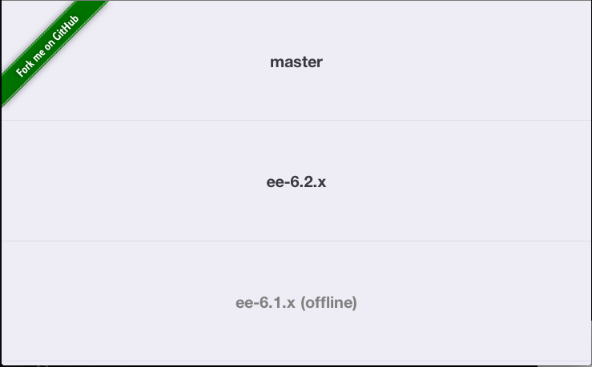

portal-instances
================

A list of your portal instances that will update with a status indicator if offline.

## Install

```
git clone git@github.com:marclundgren/portal-instances.git
```

## Temporary Configuration
* replace data-port properties within `index.html` with your appserver confiugration
* convert 1/$NUMBER_OF_INSTANCES to a decimal and replace the height in `css/main.css`

## To-do Configuration
* use CLI to manage instances

## Screenshot
